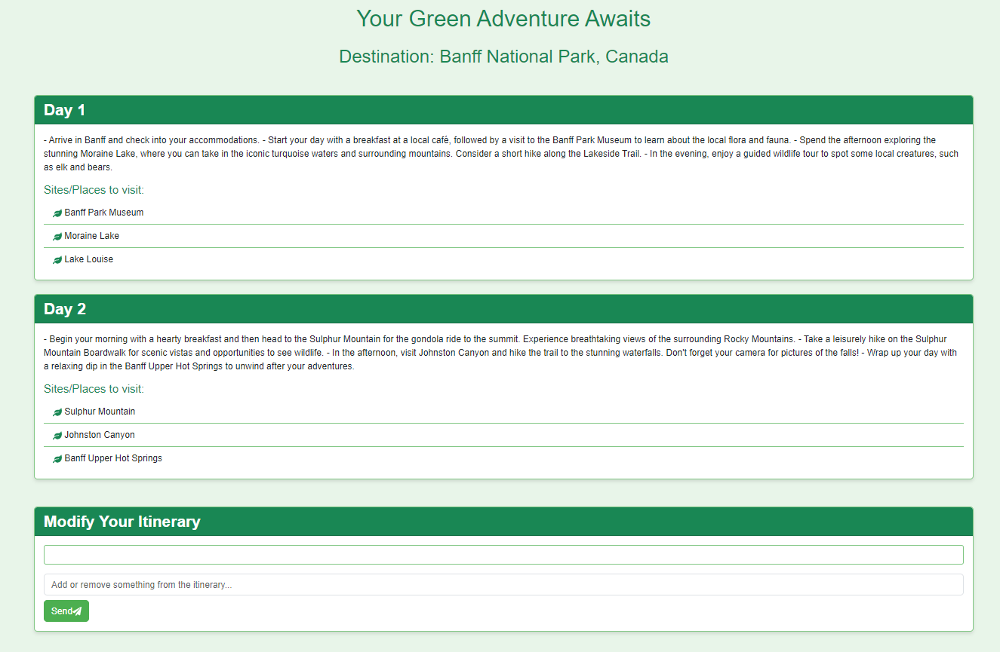

# Safar - AI Travel Itinerary Planner

Safar is an AI-powered travel itinerary planner built using **React** for the frontend and **OpenAI's GPT** for generating custom itineraries. The project allows users to select their travel preferences such as destination type, duration, and travel style, and generates a tailored itinerary based on their selections.

## Features

- Select from multiple vacation types such as Tropical, City, Mountain, Desert, and Countryside.
- Choose how long you want to stay.
- Pick a travel style: Adventurous, Relaxing, Cultural, or Nature-Lover.
- Generate a detailed itinerary using OpenAI's GPT model.
- Interactive chat feature to further modify or refine your itinerary.

## Screenshots


*Homepage: Choose your dream destination, stay duration, and travel style.*


*Itinerary Page: View your personalized itinerary.*

## Tech Stack

- **React** (Frontend)
- **Bootstrap** (Styling)
- **OpenAI API** (Generates itineraries)
- **Node.js / Express.js** (Backend for serving API requests and React app)
  
## Getting Started

To get started with the project locally, follow the steps below.

### Prerequisites

Make sure you have the following installed:

- [Node.js](https://nodejs.org/en/) (v14 or higher)
- [npm](https://www.npmjs.com/) (v6 or higher)
- An OpenAI API key (sign up [here](https://beta.openai.com/signup/))

### Installation

1. **Clone the repository:**

   ```bash
   git clone https://github.com/Skhan2602/Safar-App.git
   cd Safar-App
   ```

2. **Install dependencies for the React frontend:**

   ```bash
   cd frontend
   npm install
   ```

3. **Install dependencies for the Node.js backend:**

   In the root folder of your project, run:

   ```bash
   npm install
   ```

### Configuration

1. **Set up the OpenAI API key:**

   Create a `.env` file in the root of the project and add your OpenAI API key:

   ```bash
   REACT_APP_OPENAI_API_KEY=your-openai-api-key
   ```

2. **Backend Setup:**

   In the `server.js` file, ensure you have the proper configuration for serving the React app and handling API requests for the itinerary generation.

### Running the Application

1. **Run the Backend Server:**

   The backend serves the React app and handles API requests.

   ```bash
   node server.js
   ```

2. **Run the React Development Server:**

   To start the React app in development mode:

   ```bash
   npm start
   ```

   This will open the app at `http://localhost:3000`.

### Folder Structure

```bash
Safar-App/
├── frontend/                # React frontend
│   ├── src/
│   │   ├── components/
│   │   ├── App.js           # Main App Component
│   │   ├── ItineraryPage.js # Itinerary Page Component
│   │   └── ...
│   ├── public/
│   └── ...
├── server.js                # Node.js backend server
├── package.json             # Backend dependencies
└── README.md                # Project documentation
```

### Generating an Itinerary

1. Go to the homepage and select your travel preferences:
   - Choose a vacation type.
   - Select the number of days for your trip.
   - Pick your travel style.
   
2. Click **"Create My Dream Itinerary"** to generate a personalized travel plan.

3. The generated itinerary will be displayed on the **Itinerary Page**, where you can interact with it further.

### Customization

- You can customize the **vacation types** and **travel styles** in the `Home.js` file by updating the arrays that define the available options.
- You can modify the generated itinerary format in the `ItineraryPage.js` file by adjusting the API call and response handling logic.

## License

This project is licensed under the MIT License - see the [LICENSE](LICENSE) file for details.
